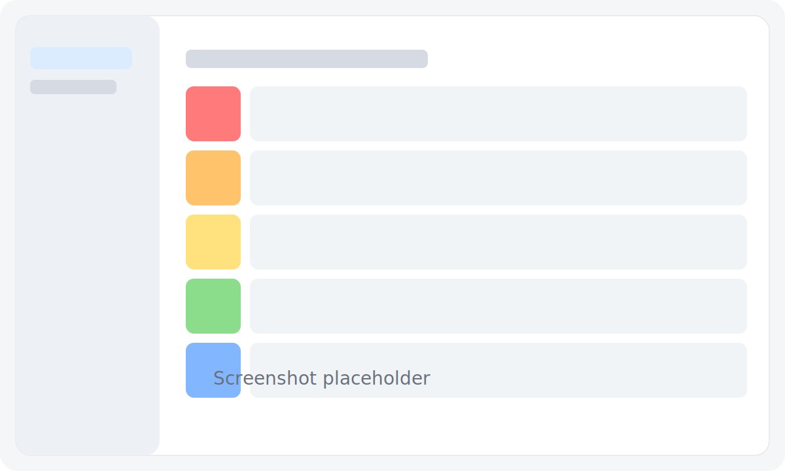

# TierListMaker

TierListMaker is a native Qt 6/C++20 desktop app for creating personal tier lists. It uses Qt
Widgets, JSON project files, local assets, QWindowKit's native window integration, and VkUI's
cross-platform control style.



## Features

- Create, save, reopen, and export `.tlmproject` files.
- Import PNG, JPEG, BMP, GIF first frames, and WebP when the Qt image plugin is available.
- Open the gallery, then drag imported images into tier rows.
- Rename, reorder, recolor, add, and remove tier rows.
- Spacebar image preview with a Quick Look-style overlay.
- Recent projects page with search and missing-file markers.
- Preferences for language, appearance, import behavior, autosave, and update checks.
- Local-first behavior with no telemetry by default.

## Build

Install Qt 6.6+, CMake 3.24+, and initialize submodules, then configure with a local Qt prefix path:

```bash
git submodule update --init --recursive
cmake -S . -B build/default -G Ninja \
  -DCMAKE_BUILD_TYPE=Debug \
  -DCMAKE_PREFIX_PATH="/path/to/Qt/6.x.x/platform"
cmake --build build/default
```

You can copy `CMakeUserPresets.json.example` to `CMakeUserPresets.json` and set your local paths there. The user preset is ignored by Git.

## Run

```bash
./build/default/TierListMaker
```

On macOS with a bundle generator:

```bash
open build/default/TierListMaker.app
```

## Test

```bash
ctest --test-dir build/default --output-on-failure
```

## Runtime Requirements

- Qt 6 Core, Gui, Widgets, Svg, Network, and Concurrent modules.
- QWindowKit 1.5.1 and VkUI 0.1.0, pinned as submodules under `third_party/`.
- A desktop platform supported by Qt 6.

## Third-Party Dependencies

- Qt 6, licensed by The Qt Company under GPL/LGPL/commercial terms.
- QWindowKit, licensed under Apache-2.0.
- VkUI, licensed under MIT.

## Privacy

TierListMaker is local-first. It does not upload user images or projects and does not include telemetry by default. See [docs/privacy.md](docs/privacy.md).

## License

MIT. See [LICENSE](LICENSE).
